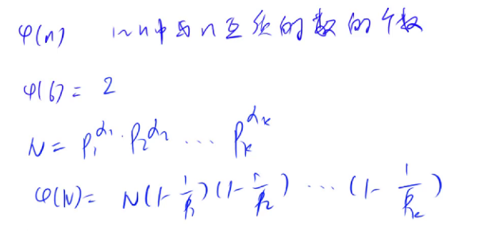

# 数学知识

## 质数

**定义**：在**大于1**的整数中， 如果只包含1和本身这两个约数，称为质数/素数。

> 试除法 O(N)  / O(sqrt(N))  

```c++
# O(N)
bool is_prime(int n)
{
	if(n < 2)return false;
	for(int i = 2; i < n; i++)
	{
		if(n % i == 0)return false;
	}
	return true;
}

# O(sqrt(N)) 
bool is_prime(int n)
{
	if(n < 2)return false;
	for(int i = 2; i <= n / i; i++)  # i <= sqrt(n)比较慢 或 i * i <= n  i*i存在溢出风险,为负数
	{
		if(n % i == 0)return false;
	}
	return true;
}
```

> 分解质因数 O(logN)   ~  O(sqrt(N))  

```c++
void divide(int x)
{
	for(int i = 2; i <= x / i; i++)#n中最多只包含一个大于sqrt(n)的质因子
		if(x % i == 0) #i一定是质数
		{
			int s = 0;
			while(x % i == 0)
			{
				x /= i;
				s ++;
			}
			cout<<i<<" "<<s<<endl;
		}
	if(n > 1)cout<<n<<" "<<1<<endl;#单独处理n中最多只包含一个大于sqrt(n)的质因子
	cout<<endl;
}
```

> 筛质数  O(NlogN)  ~  O(N)   埃氏筛法

```c++
const int N = 1000010;
int primes[N], cnt;
bool st[N];

#O(NlogN)
void get_primes(int n)
{
	for(int i = 2; i <= n; i++)
	{
		if(!st[i])
		{
			primes[cnt++] = i;
		}
		for(int j = i + i; i <= n; j += i)st[j] = true;
	}
}

#埃氏筛法
#O(NloglogN) ~= O(N) 当一个数不是质数时，不需要筛掉其倍数
void get_primes(int n)
{
	for(int i = 2; i <= n; i++)
	{
		if(!st[i])
		{
			primes[cnt++] = i;
			for(int j = i + i; i <= n; j += i)st[j] = true;
		}
	}
}
```

> 筛质数  O(NlogN)  ~  O(N)   线性筛法

```c++
# n 只会被最小质因子筛掉
void get_primes(int n)
{
	for(int i = 2; i <= n; i++)
	{
		if(!st[i])primes[cnt ++] = i;
		for(int j = 0; primes[j] <= n / i; j++)
		{
			st[primes[j] * i] = true;    //primes[j]一定是primes[j] * i的最小质因子
			if(i % primes[j] == 0)break; //primes[j]一定是i的最小质因子
		}
	}
}

#每个数都只会被它的最小质因子筛除，每个数只有一个最小质因子，故时间为线性
```

当 N = 10<sup>6</sup> 时，埃氏筛法和线性筛法一致； 当 N = 10<sup>7</sup>时，线性比埃氏快一倍

- i % pj == 0
  - pj一定是i的最小质因子， pj一定是pj*i 的最小质因子
- i % pj != 0
  - pj一定小于i的所有质因子，pj也一定是 pj*i的最小质因子


## 约数

> 试除法  O(sqrt(N))

```c++
#include<iostream>
#include<algorithm>
#include<vector>
using namespace std;

vector<int> get_divisors(int n)
{
	vector<int>res;
	for(int i = 1; i <= n / i; i++)
    if(n % i == 0)
    {
      res.push_back(i);
      if(i != n / i)res.push_back(n / i);
    }
}
```

> 约数个数

如果N = P1<sup>a1</sup> * P2<sup>a2</sup> * …… *Pk<sup>ak</sup>， 则N有(a1 + 1) * (a2 + 1) * ...... * (ak + 1)个约数


> 约数之和

如果N = P1<sup>a1</sup> * P2<sup>a2</sup> * …… *Pk<sup>ak</sup>， 则约数之和为(p1<sup>0</sup> + p1<sup>1</sup> + … + p1<sup>a1</sup> ) *… *  (pk<sup>0</sup> + pk<sup>1</sup> + … + pk<sup>ak</sup> )


> 欧几里得算法  — 辗转相除法  O(logN)

(a, b) = (b, a % b)

```c++
int gcd(int a, int b)
{
	return b ? gcd(b, a % b) : a;
}
```


## 欧拉函数

fi(n) = 1 ~ n中所有和n互质的个数

eg: fi(6) =( 1, 5 )= 2



公式推导（容斥原理）

1.从1~N中去掉p1, p2, p3, ..., pk的所有倍数： N - N/p1 - N/p2 - .... - N/pk

2.加上所有pi * pj的倍数（加上在步骤1种被多减一次的数）

3.减去所有pi * pj * pk (经过步骤1~2， pi\*pj\*pk相当于没加减，所以要减去)

总结规律：减去奇数次，加上偶数次，便可得到公式

> 公式法求欧拉函数 O(sqrt(N))

```c++
int main()
{
	int n;
	cin>>n;
	while(n --)
	{
		int a;
		cin>>a;
		int res = a;
		for(int i = 2; i <= a / i; i++)
		{
			if(a % i ==0)
			{
				res = res / i * (i - 1);
				while(a % i ==0) a /= i;
			}
		}
		if(a > 1)res = res / a * (a - 1);
		cout<<res<<endl;
	}
}
```

> 筛法求欧拉函数 O(N) 

```c++
#求1~N中所有数的欧拉函数

#include<iostream>
#include<algorithm>
using namespace std;
typedef long long LL;
const int N = 1000010;
int primes[N], cnt;
int phi[N];
bool st[N];

LL get_eulers(int n)
{
	for(int i = 2; i <= n; i++)
	{
		if(!st[i])
		{
				primes[cnt ++] = i;
				phi[i] = i - 1；
		}
    for(int j = 0; primes[j] <= n / i; j++)
    {
      	st[primes[j] * i] = true;
      	if(i % primes[j] == 0)
        {
          	phi[i * primes[j]] = phi[i] * primes[j];
          	break;
        }
      	phi[i * primes[j]] = phi[i] * (primes[i] - 1);
    }
	}
}
```

> 欧拉函数的应用

若a与n互质，则a<sup>fi(n)</sup> % n = 1, 即a的fi(n)次方 与 n 同余1


> 费马定理

当n为质数时的欧拉函数应用变为:

-  a<sup>fi(n)</sup> % n = 1
- a<sup>n - 1</sup> % n = 1


## 快速幂

快速地求出 **a<sup>k</sup> mod p** , 时间复杂度O(logK), 其中 1<= a, p, k <= 10<sup>9</sup>

> 原理

反复平方法，预处理除 a<sup>2<sup>0</sup></sup>, a<sup>2<sup>1</sup></sup>, a<sup>2<sup>2</sup></sup>, a<sup>2<sup>3</sup></sup>, ....,  a<sup>2<sup>logk</sup></sup>

```c++
int qmi(int a, int k, int p)
{
		int res = 1;
		while(k)
		{
				if(k & 1)res = (long long)res * a % p;
				k >>= 1;
				a = (long long)a * a % p;
		}
}
```


## 扩展欧几里得算法

> 裴蜀定理

对于任意一对正整数a,b，一定存在**非零**整数x,y，使得ax + by = gcd(a, b)


> 欧几里得

gcd(a, b) = gcd(b, a % b)

```
int gcd(int a, int b)
{
		return b ? gcd(b, a % b) : a;
}
```


> 扩展欧几里得

```c++
int exgcd(int a, int b, int &x, int &y)
{
		if(!b)
		{
				x = 1, y = 0;
				return a;
		}
		else
		{
				int d = exgcd(b, a % b, y, x);
				y -= a / b * x;
				return d;
		}
}
```

 

## 中国剩余定理


## 高斯消元


## 求组合数


## 容斥原理


## 博弈论

