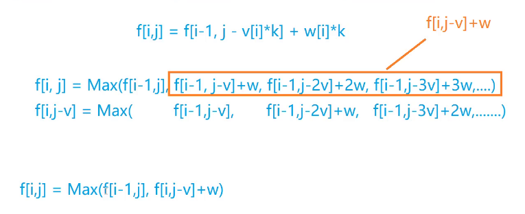
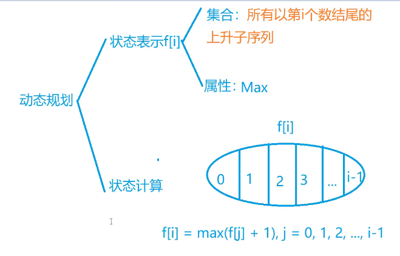
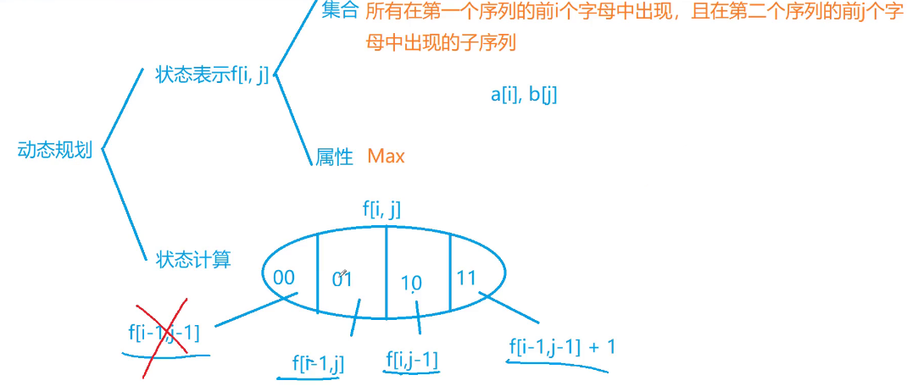
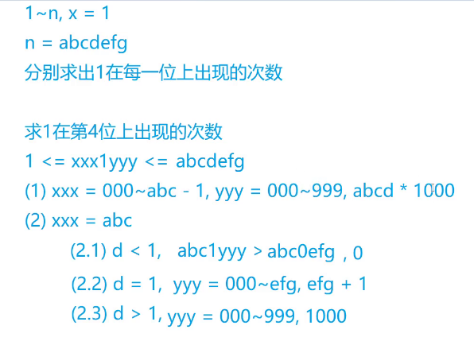

# 动态规划

## 背包问题

> 0 1 背包

每件物品最多只用一次

```
#二维表示法
#include<iostream>
#include<algorithm>
using namespace std;
const int N = 1010;

int n, m;
int v[N],w[N];
int f[N][N];
int main()
{
		cin>>n>>m;
		for(int i = 1; i <= n; i++)cin>>v[i]>>w[i];
		for(int i = 1; i <= n; i++)
				for(int j = 0; j <= m; j++)
				{
						f[i][j] = f[i - 1][j];
						if(j >= v[i])f[i][j] = max(f[i][j], f[i - 1][j - v[i]] + w[i]);
				}
		cout<<f[n][m]<<endl;
		return 0;
}

#转换成一维
int f[N];
int main()
{
		cin>>n>>m;
		for(int i = 1; i <= n; i++)cin>>v[i]>>w[i];
		for(int i = 1; i<= n; i++)
				for(int j = m; j >= v[i]; j--)
						f[j] = max(f[j], f[j - v[i]] + w[i]);
		cout<<f[m]<<endl;
		return 0;
}
```


> 完全背包

每件物品可以用无限次

```
#朴素做法 O(N*V*k)
for(int i = 1; i <= n; i++)
		for(int j = 0; j <= m; j++)
				for(int k = 0; k * v[i] <= j; k++)
						f[i][j] = max(f[i - 1][j], f[i - 1][j - v[i] * k] + w[i] * k);
```



```
#优化版O(N*V)
for(int i = 1; i <= n; i++)
		for(int j = 0; j <= m; j++)
		{
				f[i][j] = f[i - 1][j];
				if(j >= v[i])f[i][j] = max(f[i][j], f[i][j - v[i]] + w[i]);
		}
		
#一维优化版本
for(int i = 1; i <= n; i++)
		for(int j = v[i]; j <= m; j++)
		{
				f[j] = max(f[j], f[j - v[i]] + w[i]);
		}
```


> 多重背包

每个物品有s[i]个

```
#朴素版本
#include<iostream>
#include<algorithm>
using namespace std;
const int N = 110;
int n,m;
int v[N], w[N], s[N];
int f[N][N];

int main()
{
		cin>>n>>m;
		for(int i = 1; i <= n; i++)cin>>v[i]>>w[i]>>s[i];
		for(int i = 1; i <= n; i++)
				for(int j = 0; j <= m; j++)
						for(int k = 0; k <= s[i] && k * v[i] <= j; k++)
								f[i][j] = max(f[i - 1][j], f[i - 1][j - v[i]*k] + w[i] * k);
		cout<<f[n][m]<<endl;
		return 0;
}

#优化版本-二进制优化
int main()
{
		cin>>n>>m;
		int cnt = 0;
		for(int i = 1; i <= n; i++)
		{
				int a, b, s;
				cin>>a>>b>>s;
				int k = 1;
				while(k <= s)
				{
						cnt ++;
						v[cnt] = a * k;
						w[cnt] = b * k;
						s -= k;
						k *= 2;
						if(s > 0)
						{
								cnt ++;
								v[cnt] = a * s;
								w[cnt] = b * s;
						}
				}
		}
		n = cnt;
		for(int i = 1; i <= n; i ++)
				for(int j = m; j >= v[i]; j --)
						f[j] = max(f[j], f[j - v[i]] + w[i]);
		cout<<f[m]<<endl;
		return 0;
}

```


> 分组背包

物品有N组，每组有若干个，每组只能选择有限个

```
#include<iostream>
#include<algorithm>
using namespace std;
const int N = 110;

int n, m;
int v[N][N], w[N][N];
int f[N];
int main()
{
		cin>>n>>m;
		for(int i = 1; i <= n; i++)
		{
				cin>>s[i];
				for(int j = 0; j < s[i]; j++)
						cin>>v[i][j]>>w[i][j];
		}
		for(int i = 1; i <= n; i++)
				for(int j = m; j >= 0; j --)
						for(int k = 0; k < s[i]; k++)
								if(v[i][k] <= j)
										f[j] = max(f[j], f[j - v[i][k] + w[i][k]]);
		cout<<f[m]<<endl;
		return 0;
}
```


> 二维费用的背包问题

```

```


> 背包问题求方案数

```

```


> 背包物品方案

```

```


> 有依赖的背包问题

```

```


## 线性DP

> 数字三角形

```
#include<iostream>
#include<algorithm>
using namespace std;
const int N = 510, INF = 1e9;
int n;
int a[N][N];
int f[N][N];
int main()
{
		cin>>n;
		for(int i = 1; i <= n; i++)
				for(int j = 1; j <= i; j++)
						cin>>a[i][j];
		for(int i = 0; i <= n; i++)
				for(int j = 0; j <= i + 1; j++)
						f[i][j] = -INF;
		f[1][1] = a[1][1];
		for(int i = 2; i <= n; i++)
				for(int j = 1; j <= i; j++)
						f[i][j] = max(f[i - 1][j - 1] + a[i][j], f[i - 1][j - 1] + a[i][j]);
		int res = -INF;
		for(int i = 1; i <= n; i++)res = max(res, f[n][i]);
		cout<<res<<endl;
		return 0;
}
```

> 最长上升子序列
>
> 

```
#include<iostream>
#include<algorithm>
using namespace std;
const int N = 1010;
int n;
int a[N], f[N];

int main()
{
		cin>>n;
		for(int i = 1; i <= n; i++)cin>>a[i];
		
		for(int i = 1; i <= n; i++)
		{
				f[i] = 1;
				for(int j = 1; j < i; j++)
						if(a[j] < a[i])f[i] = max(f[i], f[j] + 1);
		}
		
		int res = 0;
		for(int i = 1; i <= n; i++)res = max(res, f[i]);
		cout<<res<<endl;
		return 0;
}
```


> 最长上升子序列2

```

```


> 最长公共序列
>
> 

```
#include<iostream>
#include<algorithm>
using namespace std;

const int N = 1010;
int n, m;
char a[N], b[N];
int f[N][N];
int main()
{
		cin>>n>>m;
		cin>>a + 1>>b + 1;
		for(int i = 1; i <= n; i++)
				for(int j = 1; j <= m; j++)
				{
						f[i][j] = max(f[i - 1][j], f[i][j - 1]);
						if(a[i] == b[j])f[i][j] = max(f[i][j], f[i - 1][j - 1] + 1);
				}
		cout<<f[n][m]<<endl;
		return 0;
}
```


> 最短编辑距离

```

```


> 编辑距离 

```

```


## 区间DP

> 石子合并

```
#include<iostream>
#include<algorithm>
using namespace std;
const int N = 310;
int n;
int s[N];
int f[N][N];
int main()
{
		cin>>n;
		for(int i = 1; i <= n; i++)cin>>s[i];
		for(int i = 1; i <= n; i++)s[i] += s[i - 1];
		for(int len = 2; len <= n; len ++)
				for(int i = 1; i + len - 1 <= n; i++)
				{
						int l = i, r = i + len - 1;
						f[l][r] = 1e8;
						for(int k = l; k < r; k++)
								f[l][r] = min(f[l][r], f[l][k] + f[k + 1][r] + s[r] - s[l - 1]);
				}
		cout<<f[1][n];
		return 0;
}
```


## 计数类DP

> 整数划分
>
> 

```

```


## 数位统计DP

## 状态压缩DP

## 树形DP

##记忆化搜索